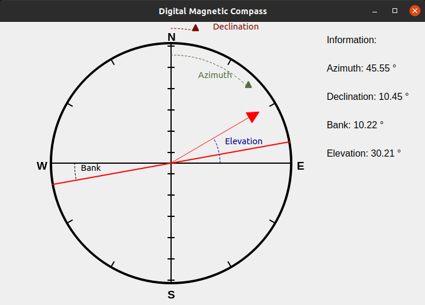
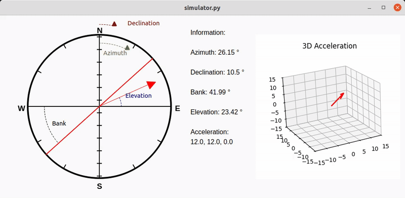

DMC VIEW

Digital Magnatic Compass View

.. start-badges

| |build| |release_version| |wheel| |supported_versions|
| |docs| |coverage| |maintainability| |tech-debt|
| |ruff| |gh-lic| |commits_since_specific_tag_on_main| |commits_since_latest_github_release|

|
| **Code:** https://github.com/alanmehio/dmc-view
| **Docs:** https://dmc-view.readthedocs.io/en/main/
| **PyPI:** https://pypi.org/project/dmc-view/
| **CI:** https://github.com/alanmehio/dmc-view/actions/
  
|
|
| |dmc_image|

 |dmc_gif|

Features
========

1. **dmcview** `python package`

   a. View Object Azimuth, Inclindation(Elevation) and Bank; also View Declination(Offset from real North)  
   b. View animation to reflect real DMC device in 2D. Acceleration is not implemented yet 
2. Tested against Linux(ubuntu-latest) `platforms` and `python` 3.12.3
3. See `TODO <TODO.rst>`_.

Change Log
==========
 `Change Log <CHANGELOG.rst>`_.

How to Contribute
=================
 `Contribute <CONTRIBUTING.md>`_.

Development
===========
| `Development <docs/source/contents/development.rst>`_

Quickstart
==========
| `Usage <docs/source/contents/usage.rst>`_

License
=======

|gh-lic|

* `GNU Affero General Public License v3.0`_

License
=======

* Free software: GNU Affero General Public License v3.0

.. LINKS

.. _GNU Affero General Public License v3.0: https://github.com/alanmehio/dmc-view/blob/main/LICENSE

.. BADGE ALIASES

.. Build Status
.. Github Actions: Test Workflow Status for specific branch <branch>

.. |build| image:: https://img.shields.io/github/workflow/status/alanmehio/dmc-view/Test%20Python%20Package/main?label=build&logo=github-actions&logoColor=%233392FF
    :alt: GitHub Workflow Status (branch)
    :target: https://github.com/alanmehio/dmc-view/actions/workflows/test.yaml?query=branch%3Amain

.. Documentation

.. |docs| image:: https://img.shields.io/readthedocs/dmc-view/main?logo=readthedocs&logoColor=lightblue
    :alt: Read the Docs (version)
    :target: https://dmc-view.readthedocs.io/en/main/

.. Code Coverage

.. |coverage| image:: https://img.shields.io/codecov/c/github/alanmehio/dmc-view/main?logo=codecov
    :alt: Codecov
    :target: https://app.codecov.io/gh/alanmehio/dmc-view

.. PyPI

.. |release_version| image:: https://img.shields.io/pypi/v/dmcview
    :alt: Production Version
    :target: https://pypi.org/project/dmc-view/

.. |wheel| image:: https://img.shields.io/pypi/wheel/dmc-view?color=green&label=wheel
    :alt: PyPI - Wheel
    :target: https://pypi.org/project/dmc-view

.. |supported_versions| image:: https://img.shields.io/pypi/pyversions/dmc-view?color=blue&label=python&logo=python&logoColor=%23ccccff
    :alt: Supported Python versions
    :target: https://pypi.org/project/dmc-view

.. Github Releases & Tags

.. |commits_since_specific_tag_on_main| image:: https://img.shields.io/github/commits-since/alanmehio/dmc-view/v0.0.1/main?color=blue&logo=github
    :alt: GitHub commits since tagged version (branch)
    :target: https://github.com/alanmehio/dmc-view/compare/v0.0.1..main

.. |commits_since_latest_github_release| image:: https://img.shields.io/github/commits-since/alanmehio/dmc-view/latest?color=blue&logo=semver&sort=semver
    :alt: GitHub commits since latest release (by SemVer)

.. LICENSE (eg AGPL, MIT)
.. Github License

.. |gh-lic| image:: https://img.shields.io/badge/license-GNU_Affero-orange
    :alt: GitHub
    :target: https://github.com/alanmehio/dmc-view/blob/main/LICENSE

.. CODE QUALITY

.. Ruff linter for Fast Python Linting

.. |ruff| image:: https://img.shields.io/badge/codestyle-ruff-000000.svg
    :alt: Ruff
    :target: https://docs.astral.sh/ruff/

.. Code Climate CI
.. Code maintainability & Technical Debt

.. |maintainability| image:: https://img.shields.io/codeclimate/maintainability/alanmehio/dmc-view
    :alt: Code Climate Maintainability
    :target: https://codeclimate.com/github/alanmehio/dmc-view

.. |tech-debt| image:: https://img.shields.io/codeclimate/tech-debt/alanmehio/dmc-view
    :alt: Technical Debt
    :target: https://codeclimate.com/github/alanmehio/dmc-view

.. Local linux command: CTRL+Shift+Alt+R key 

.. Local Image and YouTube Vedio as link

